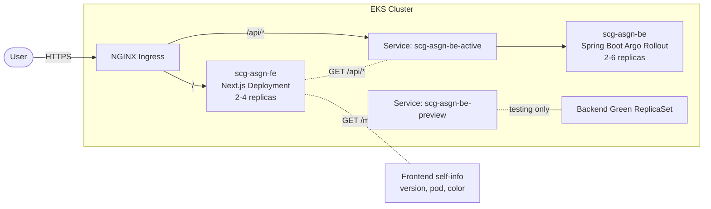
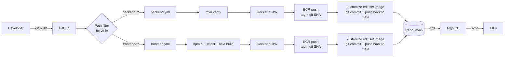

# scg-asgn — DevOps assignment

A 2-service microservice (Spring Boot backend + Next.js frontend) with
Kubernetes manifests, blue/green via Argo Rollouts, per-service CI/CD, and
a frontend that visualises which backend pod served each request — so you
can *see* a blue/green flip happen in real time.

> **Status of this README:** reflects everything actually built in the repo.
> Anything still planned is called out under [Not yet built](#not-yet-built).

---

## Table of Contents

1. [Architecture](#architecture)
2. [Repository layout](#repository-layout)
3. [Naming convention](#naming-convention)
4. [Quickstart — Docker Compose](#quickstart--docker-compose)
5. [Quickstart — Kubernetes](#quickstart--kubernetes)
6. [CI/CD pipelines](#cicd-pipelines)
7. [Environments](#environments)
8. [Configuration & secrets](#configuration--secrets)
9. [Not yet built](#not-yet-built)

---

## Architecture

### Application



The frontend has two paths:
- `/api/*` — proxied via a runtime route handler (`app/api/[...path]/route.ts`)
  to `BACKEND_URL`. Every backend response carries `X-App-Version`,
  `X-Pod-Name`, `X-Rollout-Color`.
- `/meta` — frontend's own server-side endpoint reporting *its* version, pod,
  and color (read from env at request time, not baked at build).

The UI shows two cards side-by-side. When Argo Rollouts flips
`scg-asgn-be-active` from blue to green, the next poll reflects it instantly
in the backend card. The frontend card flips independently when its own
deployment is updated.

### CI/CD pipeline (GitOps)



Two **independent** workflows. CI builds + commits the new image tag to
the env's overlay. **Argo CD** runs on the cluster, watches each overlay
path, and applies changes — the cluster pulls instead of CI pushing.

---

## Repository layout

```
.
├── compose.yml                                Local dev (BE + FE)
├── Makefile                                   Common targets (make help)
│
├── .github/workflows/
│   ├── backend.yml                            test → build → push → commit-bump BE
│   └── frontend.yml                           test → build → push → commit-bump FE
│
├── argocd/                                    GitOps config (app-of-apps)
│   ├── bootstrap/
│   │   └── root-app.yaml                      manual `kubectl apply` once
│   └── managed/                               owned by root-app once bootstrapped
│       ├── project.yaml                       AppProject (RBAC scope)
│       └── applicationset.yaml                generates 4 Applications (one per env)
│
├── infra/                                     (placeholder — Terraform pending)
│   └── manual/                                EKS access bootstrap snippets
│
└── project/scg-asgn/
    │
    ├── backend/                               Spring Boot 3.4 / Java 21
    │   ├── pom.xml
    │   ├── Dockerfile                         2-stage layered jar
    │   └── src/
    │       ├── main/java/com/scg/asgn/
    │       │   ├── Application.java
    │       │   ├── api/
    │       │   │   ├── Item.java              record { id, name, createdAt }
    │       │   │   ├── CreateItemRequest.java @NotBlank validation
    │       │   │   ├── ItemService.java       in-memory ConcurrentHashMap
    │       │   │   ├── ItemController.java    /api/items CRUD
    │       │   │   └── HealthController.java  /api/health (smoke target)
    │       │   ├── web/
    │       │   │   └── VersionHeadersFilter.java   X-App-Version, X-Pod-Name, X-Rollout-Color
    │       │   └── config/
    │       │       └── ClockConfig.java
    │       ├── main/resources/
    │       │   ├── application.yml            actuator probes, graceful shutdown
    │       │   └── logback-spring.xml         ECS-JSON encoder
    │       └── test/java/com/scg/asgn/api/
    │           └── ItemControllerTest.java    SpringBootTest + MockMvc
    │
    ├── frontend/                              Next.js 15 + React 19 + Tailwind 3
    │   ├── package.json
    │   ├── next.config.mjs                    output: "standalone"
    │   ├── tsconfig.json
    │   ├── tailwind.config.ts                 rolloutBlue + rolloutGreen tokens
    │   ├── postcss.config.mjs
    │   ├── vitest.config.ts
    │   ├── Dockerfile                         3-stage (deps → builder → runner)
    │   ├── public/                            (placeholder for static assets)
    │   ├── app/
    │   │   ├── layout.tsx
    │   │   ├── page.tsx                       polls /api/items every 2s
    │   │   ├── globals.css
    │   │   ├── api/[...path]/route.ts         runtime proxy → $BACKEND_URL
    │   │   ├── meta/route.ts                  frontend self-info (version, pod, color)
    │   │   ├── lib/{api,types}.ts             fetch wrapper + types
    │   │   └── components/
    │   │       ├── VersionBanner.tsx          two cards: frontend + backend
    │   │       ├── ItemList.tsx
    │   │       └── CreateItemForm.tsx
    │   └── __tests__/
    │       └── api.test.ts                    fetch wrapper extracts X-* headers
    │
    └── deployment/                            Kustomize
        ├── kustomizeconfig.yaml               teaches kustomize about Argo Rollout name refs
        ├── base/
        │   ├── kustomization.yaml             includes backend + frontend
        │   ├── backend/
        │   │   ├── rollout.yaml               Argo Rollout (blue/green)
        │   │   ├── service-active.yaml        scg-asgn-be-active
        │   │   ├── service-preview.yaml       scg-asgn-be-preview
        │   │   ├── analysistemplate.yaml      Prometheus success-rate query
        │   │   ├── configmap.yaml
        │   │   ├── hpa.yaml                   targets the Rollout (apiVersion argoproj.io)
        │   │   └── kustomization.yaml
        │   └── frontend/
        │       ├── deployment.yaml
        │       ├── service.yaml
        │       ├── ingress.yaml               /api → BE-active, / → FE
        │       ├── hpa.yaml
        │       ├── configmap.yaml
        │       └── kustomization.yaml
        └── overlays/
            ├── local/                         app-local · replicas=1 · analysis OFF · image :local
            ├── dev/                           app-dev · replicas=1 · analysis OFF · autopromote 60s
            ├── qa/                            app-qa · replicas=2 · analysis OFF · autopromote default
            ├── staging/                       app-staging · replicas=2 · analysis ON
            └── prod/                          app-prod · replicas=3 · analysis ON · manual promote · scaleDown 30m
```

---

## Naming convention

`{company}-{project}-{service}-{env}` — applied via `nameSuffix: -<env>` in
each overlay. Per-env namespace too.

| Env (namespace) | Backend rollout | Frontend deployment | Ingress | Pod (example) |
|---|---|---|---|---|
| `app-local` | `scg-asgn-be-local` | `scg-asgn-fe-local` | `scg-asgn-local` | `scg-asgn-be-local-7d4c-abc12` |
| `app-dev` | `scg-asgn-be-dev` | `scg-asgn-fe-dev` | `scg-asgn-dev` | `scg-asgn-be-dev-…` |
| `app-qa` | `scg-asgn-be-qa` | `scg-asgn-fe-qa` | `scg-asgn-qa` | `scg-asgn-be-qa-…` |
| `app-staging` | `scg-asgn-be-staging` | `scg-asgn-fe-staging` | `scg-asgn-staging` | `scg-asgn-be-staging-…` |
| `app-prod` | `scg-asgn-be-prod` | `scg-asgn-fe-prod` | `scg-asgn-prod` | `scg-asgn-be-prod-…` |

`kustomizeconfig.yaml` teaches kustomize how to update Argo Rollout name
references (`activeService`, `previewService`, `templateName`) so the suffix
propagates correctly.

---

## Quickstart — Docker Compose

Validates the apps without touching Kubernetes.

```bash
make local-up          # docker compose up --build
# wait for "Container scg-asgn-fe-local Started"

# Sanity:
curl http://localhost:8080/api/health
curl http://localhost:8080/api/items
curl http://localhost:3000/meta
curl http://localhost:3000/api/items   # via FE runtime proxy

# Browser:
open http://localhost:3000             # banner shows two cards (FE + BE)
```

Tear down:
```bash
make local-down
```

Other useful targets:
```bash
make help                # list all
make be-test / fe-test
make be-run / fe-run     # run on host without Docker
make render-dev          # kustomize build overlays/dev
```

---

## Quickstart — Kubernetes

### One-time cluster prep

Required:
```bash
# Argo Rollouts controller (your Rollout CRD needs this)
kubectl create namespace argo-rollouts
kubectl apply -n argo-rollouts -f \
  https://github.com/argoproj/argo-rollouts/releases/latest/download/install.yaml

# metrics-server (HPA needs this; EKS doesn't ship it)
kubectl apply -f \
  https://github.com/kubernetes-sigs/metrics-server/releases/latest/download/components.yaml

# NGINX Ingress (your Ingress resources reference ingressClassName: nginx)
helm upgrade --install ingress-nginx ingress-nginx \
  --repo https://kubernetes.github.io/ingress-nginx \
  --namespace ingress-nginx --create-namespace \
  --set controller.service.type=LoadBalancer
```

Optional (only when needed):
- `kube-prometheus-stack` — required by staging/prod `AnalysisTemplate`. dev/qa
  patch analysis out, so they work without Prometheus.
- `cert-manager` — only for HTTPS via Let's Encrypt.
- Loki + Fluent Bit — for log aggregation. Apps already emit ECS-JSON to stdout.

### Local kind/minikube

```bash
docker build -t backend:local  project/scg-asgn/backend
docker build -t frontend:local project/scg-asgn/frontend
kind load docker-image backend:local frontend:local --name <cluster>

kubectl apply -k project/scg-asgn/deployment/overlays/local

kubectl -n app-local get rollout,deploy,svc,ingress,pods
kubectl argo rollouts get rollout scg-asgn-be-local -n app-local --watch

kubectl -n app-local port-forward svc/scg-asgn-fe-local 3000:80
# open http://localhost:3000
```

### EKS (GitOps via Argo CD)

**1. Bootstrap kubeconfig + admin access:**
```bash
aws eks update-kubeconfig \
  --region ap-southeast-1 \
  --name scg-asgn-eks-mandatory-np

aws eks create-access-entry \
  --cluster-name scg-asgn-eks-mandatory-np \
  --region ap-southeast-1 \
  --principal-arn arn:aws:iam::<ACCOUNT>:user/<USER>

aws eks associate-access-policy \
  --cluster-name scg-asgn-eks-mandatory-np \
  --region ap-southeast-1 \
  --principal-arn arn:aws:iam::<ACCOUNT>:user/<USER> \
  --policy-arn arn:aws:eks::aws:cluster-access-policy/AmazonEKSClusterAdminPolicy \
  --access-scope type=cluster
```

**2. Install Argo CD on the cluster:**
```bash
kubectl create namespace argocd
kubectl apply -n argocd -f \
  https://raw.githubusercontent.com/argoproj/argo-cd/stable/manifests/install.yaml

# Wait for Argo CD pods
kubectl -n argocd wait --for=condition=available --timeout=300s deployment/argocd-server

# Get the initial admin password
kubectl -n argocd get secret argocd-initial-admin-secret \
  -o jsonpath="{.data.password}" | base64 -d; echo
```

**3. Edit repo URL placeholders:**
Replace `<OWNER>` in:
- `argocd/bootstrap/root-app.yaml`
- `argocd/managed/project.yaml`
- `argocd/managed/applicationset.yaml`

(All three reference `https://github.com/<OWNER>/scg-sre-assignment.git`.)

**4. Apply the root Application — once:**
```bash
kubectl apply -f argocd/bootstrap/root-app.yaml
```

That's it. The root Application points at `argocd/managed/`, which contains
the AppProject and ApplicationSet. The ApplicationSet expands into one
Application per env (`scg-asgn-dev`, `-qa`, `-staging`, `-prod`), each
watching its own overlay folder.

**5. Watch the apps appear and sync:**
```bash
kubectl -n argocd get applications.argoproj.io
# Or open the UI:
kubectl -n argocd port-forward svc/argocd-server 8443:443
# https://localhost:8443  (user: admin, password from step 2)
```

**6. Trigger a deploy:**
Push a code change to `main` (or run `backend.yml` / `frontend.yml` manually).
CI builds the image, pushes to ECR, and **commits the image-tag bump back
to `main`**. Argo CD sees the commit and syncs the cluster.

---

## CI/CD pipelines

Two independent workflows, one per service. Each: **test → build-push →
bump-image (git commit)**. Argo CD picks up the commit and syncs.

| Trigger | What runs |
|---|---|
| PR touching `scg-asgn/backend/**` | `backend.yml` test job only |
| PR touching `scg-asgn/frontend/**` | `frontend.yml` test job only |
| Push to `main` touching backend code | `backend.yml` full pipeline → bumps **dev** overlay |
| Push to `main` touching frontend code | `frontend.yml` full pipeline → bumps **dev** overlay |
| Manual dispatch on either workflow | choose env (`dev`/`qa`/`staging`/`prod`) + optional `image_tag` |
| Manual dispatch with `image_tag` set | skips build, just bumps that env to that pre-built tag |

**Image tag scheme:** 12-char git SHA. Promotion = manual dispatch with the
tag of a previously built image — so prod can deploy a tag that's been
running in staging for a week.

**Bump commits use `[skip ci]`** to avoid retriggering the workflow. Path
filters also exclude overlay paths, so manifest-only commits don't rebuild
images.

**Concurrency-safe bumps:** the `bump-image` job uses
`concurrency: gitops-bump-<env>` and a `git pull --rebase` retry loop, so
two simultaneous bumps to the same env serialize cleanly.

### ECR public/private toggle

Single repo variable controls registry mode without code changes:

| Repo variable | Value | Effect |
|---|---|---|
| `ECR_TYPE` | `public` (default) | Pushes to AWS Public ECR (us-east-1 forced for the push step) |
| `ECR_TYPE` | `private` | Pushes to standard ECR in `vars.AWS_REGION` |

Set:
- `vars.ECR_TYPE` = `public` or `private`
- `vars.AWS_REGION` = `ap-southeast-1` (cluster region)
- `secrets.ECR_REGISTRY` = full URL prefix (`public.ecr.aws/<alias>` or `<acct>.dkr.ecr.<region>.amazonaws.com`)
- `secrets.AWS_CI_ROLE_ARN` (OIDC role with `ecr-public:*` or `ecr:*` for image push)
- `secrets.GITOPS_TOKEN` — PAT or GitHub App token with `contents:write` on this repo (for the bump commit)

The workflows automatically swap region to `us-east-1` for ECR Public push,
because the `ecr-public` API only exists there. CD always uses your real
region for EKS calls.

### API contract rule (since deploys are independent)

> **Add fields/endpoints first; deprecate later; never remove in the same
> release.** Independent FE/BE deploys mean either side may be a version
> behind for a few minutes during a rollout.

---

## Environments

Configured per overlay in `project/scg-asgn/deployment/overlays/`.

| Overlay | Auto-promote | Analysis | scaleDownDelay | HPA | Notes |
|---|---|---|---|---|---|
| `local` | yes (irrelevant) | OFF (patched) | default | base | image `:local` |
| `dev` | 60s | OFF | 60s | base | every push to main |
| `qa` | 300s | OFF | default 600s | base | manual promotion |
| `staging` | 300s | **ON** (Prom) | 600s | base | last gate before prod |
| `prod` | **manual** | **ON** | **1800s** (30m) | 3 → 10 | larger resources, manual promote |

**E2E tests** are not a separate overlay — they run as a CI job against
the `dev` deploy. Add them under each service's `test` step when ready.

---

## Configuration & secrets

12-factor: **all config via env**, no hardcoded URLs.

### Backend env

| Env | Source | Used for |
|---|---|---|
| `APP_VERSION` | ConfigMap `scg-asgn-be-config` | `X-App-Version` response header |
| `ROLLOUT_COLOR` | ConfigMap | `X-Rollout-Color` response header |
| `HOSTNAME` | downward API (`metadata.name`) | `X-Pod-Name` response header |
| `POD_NAMESPACE` | downward API | logs |

### Frontend env (planned for k8s; already in compose)

| Env | Source | Used for |
|---|---|---|
| `BACKEND_URL` | ConfigMap (planned) | runtime proxy target in `app/api/[...path]/route.ts` |
| `NEXT_PUBLIC_APP_VERSION` | ConfigMap | reported by `/meta` |
| `ROLLOUT_COLOR` | ConfigMap | reported by `/meta` |
| `POD_NAME` / `HOSTNAME` | downward API (planned) | reported by `/meta` |

> **Pending:** the FE base `deployment.yaml` doesn't yet inject `BACKEND_URL`,
> `POD_NAME`, or `ROLLOUT_COLOR`. Without `BACKEND_URL`, the FE pod's `/api/*`
> proxy falls back to `localhost:8080` and 500s. Wire-up is on the punch list.

### Secrets

Currently none — the in-memory store needs no DB credentials. When you add
Postgres or similar, plumb via Kubernetes `Secret` (and later External
Secrets Operator + AWS SSM for prod).

---

## Not yet built

Honest punch list of what's deliberately scoped out so far:

| Item | What's missing | Where it would go |
|---|---|---|
| **FE env wiring** | `BACKEND_URL`, `POD_NAME`, `ROLLOUT_COLOR` on the FE Deployment | `base/frontend/deployment.yaml` + `configmap.yaml` |
| **Terraform** | VPC, EKS, ECR as code | `infra/` |
| **Persistence** | Postgres + repository abstraction | backend `api/` + Helm/kustomize |
| **Observability stack** | Prometheus / Grafana / Loki / Fluent Bit installs | `k8s-addons/` install scripts |
| **Pipeline scans** | Gitleaks, Trivy, SBOM, Cosign | `backend.yml` / `frontend.yml` pre-build steps |
| **HTTPS** | cert-manager + Let's Encrypt | `k8s-addons/` + Ingress annotations |
| **Component tests** | React Testing Library tests for `VersionBanner`, `ItemList`, `CreateItemForm` | `frontend/__tests__/` |
| **Route-handler tests** | Tests for `/meta` and `/api/[...path]` | `frontend/__tests__/` |

---

## License

MIT — assignment submission.
